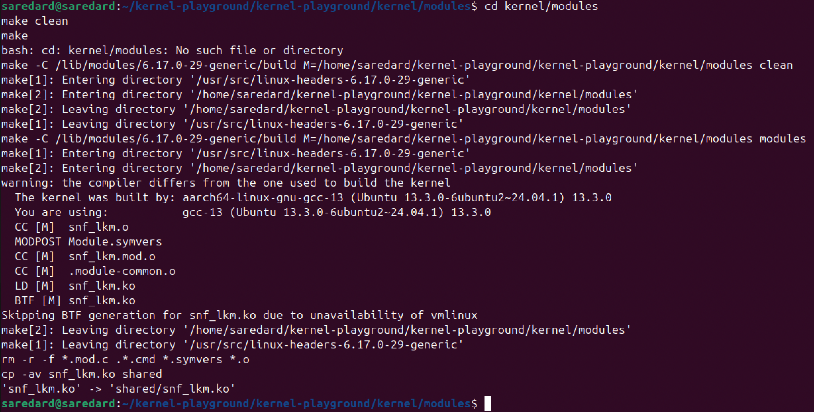
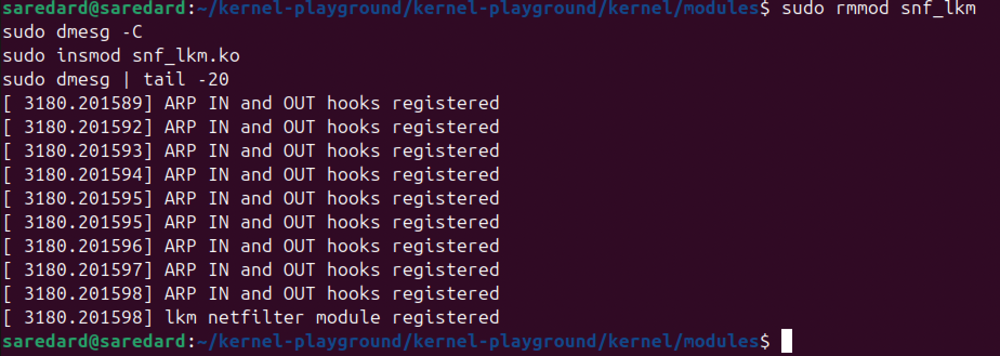
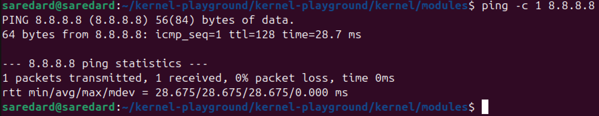
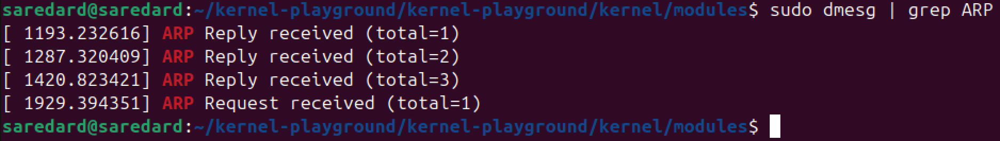

# M8 – ARP Traffic Inspector (Basic Level)

## Project Description

This project implements the **ARP Traffic Inspector** assignment using a Linux Kernel Module based on the Netfilter framework.

The original example provided in the kernel-playground repository inspected ICMPv6 traffic. The implementation was modified to inspect ARP traffic instead and count both ARP Requests and ARP Replies.

The module performs passive monitoring only. All packets are accepted and continue through the Linux networking stack without being modified or blocked.

---

## Project Objectives

The objectives of this project are:

* Understand Linux Kernel Module development.
* Learn how Netfilter hooks work inside the Linux kernel.
* Inspect ARP traffic at kernel level.
* Count ARP Requests and ARP Replies.
* Perform testing and validation through reproducible experiments.

---

## Design Choices

The following modifications were made to the original Netfilter example:

* Removed the IPv6 and ICMPv6 specific logic.
* Added ARP packet parsing using `arp_hdr()`.
* Added counters for ARP Requests and ARP Replies.
* Registered two Netfilter hooks:

  * `NF_ARP_OUT` for outgoing ARP packets (typically Requests).
  * `NF_ARP_IN` for incoming ARP packets (typically Replies).
* Kept `NF_ACCEPT` as the return value so packets are never blocked.

Using two hooks allows the module to observe both directions of ARP traffic during the same execution.

---

## Implementation Details

The module inspects ARP packets through a Netfilter callback function.

For each packet:

1. The ARP header is extracted using `arp_hdr(skb)`.
2. The ARP operation field (`ar_op`) is checked.
3. The corresponding counter is updated.
4. A message is printed to the kernel log using `printk()`.

The following packet types are detected:

* `ARPOP_REQUEST`
* `ARPOP_REPLY`

The module maintains two independent counters:

* `arp_requests`
* `arp_replies`

All packets are accepted by returning:

```c
return NF_ACCEPT;
```

---

## Build Instructions

Move to the module directory:

```bash
cd kernel/modules
```

Compile the module:

```bash
make clean
make
```

Successful compilation produces:

```text
snf_lkm.ko
```

---

## Experiment Reproduction

### 1. Load the Module

```bash
sudo insmod snf_lkm.ko
```

Verify successful loading:

```bash
sudo dmesg | tail -20
```

Expected output:

```text
ARP IN and OUT hooks registered
lkm netfilter module registered
```

---

### 2. Generate ARP Traffic

Clear the ARP cache:

```bash
sudo ip neigh flush all
```

Generate network traffic:

```bash
ping -c 1 8.8.8.8
```

---

### 3. Observe ARP Activity

Display ARP-related kernel messages:

```bash
sudo dmesg | grep ARP
```

Example output:

```text
ARP Request received (total=1)
ARP Reply received (total=1)
```

---

### 4. Remove the Module

```bash
sudo rmmod snf_lkm
```

Verify successful removal:

```bash
sudo dmesg | tail -20
```

Expected output:

```text
ARP IN and OUT hooks unregistered
lkm netfilter module unregistered
```

---

## Experimental Results

The module successfully detected and counted both ARP Requests and ARP Replies.

Observed output during testing:

```text
ARP Request received (total=1)
ARP Reply received (total=1)
```

This confirms that:

* The outgoing ARP hook is functioning correctly.
* The incoming ARP hook is functioning correctly.
* Both packet types are correctly identified and counted.

---

## Experimental Evidence

### 1. Module Compilation

The module was successfully compiled.



### 2. Module Loading

The module was loaded successfully and both ARP hooks were registered.



### 3. Traffic Generation

ARP traffic was generated by clearing the ARP cache and sending network traffic.



### 4. ARP Detection

The module successfully detected and counted both ARP Requests and ARP Replies.



### 5. Module Removal

The module was unloaded successfully and both hooks were unregistered.


---

## Source Files

Main source file:

```text
kernel/modules/snf_lkm.c
```

Compiled module:

```text
kernel/modules/snf_lkm.ko
```

---

## Conclusion

This project demonstrates how Linux Kernel Modules can be combined with Netfilter hooks to inspect ARP traffic inside the Linux kernel.

Through this implementation, I gained practical experience with:

* Linux kernel programming
* Netfilter packet processing
* ARP protocol inspection
* Kernel logging using printk()
* Building, loading, testing, and removing custom kernel modules

The final implementation successfully fulfills the requirements of the **ARP Traffic Inspector** assignment by counting both ARP Requests and ARP Replies without interfering with normal network operation.
